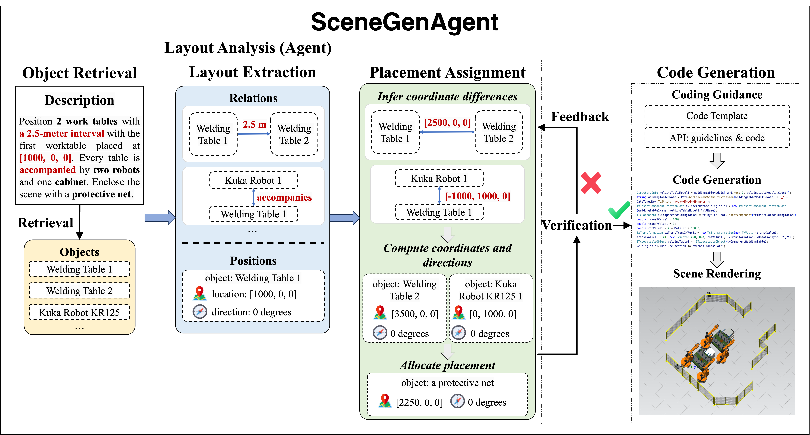

# SceneGenAgent: Precise Industrial Scene Generation with Coding Agent

<p align="center">
   📃 <a href="https://arxiv.org/abs/TODO" target="_blank">Paper</a> • 🤗 <a href="https://huggingface.co/collections/Rishubi/scenegenagent-671f685670f231ff42bd6a30" target="_blank">HF Repo</a> <br>
</p>

SceneGenAgent is an LLM-based agent for generating industrial scenes through C# code, aimed at meeting the demand for precise measurements and positioning in industrial scene generation. SceneGenAgent ensures precise layout planning through a structured and calculable format, layout verification, and iterative refinement to meet the quantitative requirements of industrial scenarios. Experiment results demonstrate that LLMs powered by SceneGenAgent exceed their original performance, reaching up to 81.0% success rate in real-world industrial scene generation tasks and effectively meeting most scene generation requirements. To further enhance accessibility, we construct SceneInstruct, a dataset designed for fine-tuning open-source LLMs to integrate into SceneGenAgent. Experiments show that fine-tuning open-source LLMs on SceneInstruct yields significant performance improvements, with Llama3.1-70B approaching the capabilities of GPT-4o.

This repository is the code for deploying SceneGenAgent as a Gradio application and training models with SceneInstruct to be integrated into SceneGenAgent.

<p align="center">
    
</p>

<p align="center">
    
</p>

- [SceneGenAgent: Precise Industrial Scene Generation with Coding Agent](#scenegenagent-precise-industrial-scene-generation-with-coding-agent)
  - [Install Dependency](#install-dependency)
  - [Running SceneGenAgent Demo](#running-scenegenagent-demo)
  - [Training with SceneInstruct](#training-with-sceneinstruct)
  - [Evaluation](#evaluation)
  - [Citation](#citation)

## Install Dependency

```shell
git clone https://github.com/THUDM/SceneGenAgent.git
cd SceneGenAgent
pip install -r requirements.txt
```

## Running SceneGenAgent Demo

To run the SceneGenAgent demo with API-basd or offline models, please refer to the instructions in [inference.md](scenegenagent/inference.md#run-scenegenagent-gradio-demo).

## Training with SceneInstruct

To train models with SceneInstruct as the backbone of SceneGenAgent, please follow the instructions in [train.md](training/train.md).

## Evaluation

We evaluate the performance of industrial scene generation by curating a benchmark containing scene descriptions written by engineers and manually checking the correctness of each generation. Here are our evaluation results:

<p align="center">
    
</p>

To run generation on our benchmark, please follow the instructions in [inference.md](scenegenagent/inference.md#run-evaluation-on-benchmark).

## Citation

TODO
